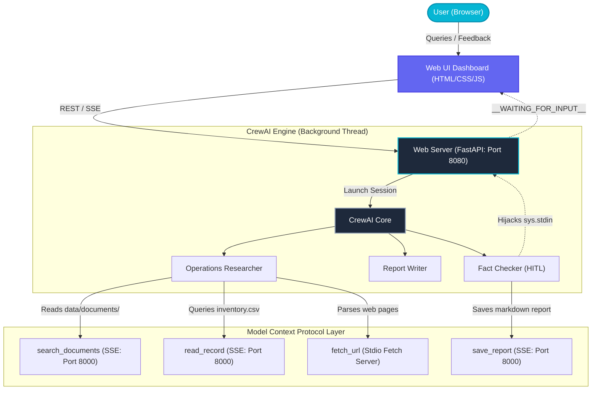

# Operations Assistant

[](https://github.com)
[](https://www.python.org)
[](https://github.com/astral-sh/uv)
[](https://github.com/crewAIInc/crewAI)
[](https://modelcontextprotocol.io)
[](https://github.com/jlowin/fastmcp)
[](https://fastapi.tiangolo.com)

Designed, engineered, and customized by **Anirudh Sharma**, this project is a premium multi-agent AI system (powered by CrewAI) integrated with Model Context Protocol (MCP) servers and a high-end web dashboard. The Assistant helps operations teams answer business questions automatically by searching local documentation, looking up stock levels in the product database, and researching external web pages.

---

## What It Does

This system replaces manual operational lookups with an automated agent workflow that handles research, report synthesis, and fact-checking.

1. **Internal Knowledge Retrieval**: Searches standard operating procedures (SOPs), return policies, and customer service tickets located in `data/documents/` using semantic search.
2. **Structured Inventory Checking**: Queries the product database (`data/inventory.csv`) by record ID to fetch product SKUs, stock levels, statuses, and pricing.
3. **Outbound Web Research**: Employs a Stdio Fetch MCP server to pull down HTML pages and search for external market details (shipping fees, vendor rates, competitor comparisons).
4. **Fact-Checked Operational Reports**: Creates clean Markdown reports with verification gates. If a claim is unsupported, the agent prompts for human-in-the-loop review.
5. **Interactive Web Dashboard**: A glassmorphic dark-mode web console that enables queries, displays live logs line-by-line via Server-Sent Events (SSE), and offers interactive button/text feedback modals to validate the agent's draft reports in real-time.

---

## Interactive Web UI (Designed by Anirudh Sharma)

The web dashboard provides a complete control center to view and operate the system:
* **Business Console**: Submit questions, view step-by-step progress of running agents, stream standard output/stderr live, and accept report drafts through the human validation popup.
* **SOP Document Browser**: Search and read internal text documents directly from the UI.
* **Product Inventory Database**: Search and filter the csv inventory records by keyword, stock status, or SKU.
* **Generated Reports Viewer**: Browse previous reports saved to `outputs/` rendered in formatted Markdown.
* **Telemetry & Traces Visualizer**: Inspect run summaries, token metrics, and execution trace logs.

---

## Architecture Flow



---

## Quick Start Guide

### 1. Environment Setup

Configure a python virtual environment and sync all project dependencies:
```bash
# 1. Install the uv package manager if you do not have it:
python3 -m pip install uv

# 2. Sync project dependencies:
uv sync

# 3. Create your .env file:
cp .env.example .env
```

Open the `.env` file and enter your `GROQ_API_KEY` (and optionally, Langfuse cloud keys for dashboard tracing).

### 2. Run the Core MCP Server (SSE)
Start the MCP SSE server in your first terminal session:
```bash
uv run python server/mcp_server.py
```
This starts the FastMCP server on `http://127.0.0.1:8000/sse` exposing the tools `search_documents`, `read_record`, and `save_report`. Keep this terminal running.

### 3. Run the Web Dashboard
Start the FastAPI dashboard server in a second terminal session:
```bash
uv run python server/web_server.py
```
This starts the web server on `http://127.0.0.1:8080`.

### 4. Access the Dashboard
Open your browser and navigate to:
```
http://localhost:8080
```
Here, you can run queries, browse the dataset, see agent logs in real time, and submit interactive feedback!

---

## Alternative CLI Execution

If you prefer using the terminal command line, you can kickoff the crew directly:
```bash
# Start the MCP SSE server in terminal 1:
uv run python server/mcp_server.py

# In terminal 2, ask the crew your query:
uv run python -m crew.crew "What is the return policy for headphones?"
```
The terminal will output the agent logs and prompt you to input `y` or custom text when the Fact Checker runs. The generated trace files and reports will be saved to `traces/` and `outputs/`.

---

## Running Automated Tests

Run the test suite using pytest to verify tools and guardrail modules:
```bash
uv run pytest tests/ -v
```

---

## Project Customization Credits

* **Lead Architect & UX Designer**: Anirudh Sharma
* **Agent Framework**: CrewAI
* **Transport Protocols**: SSE and Stdio Model Context Protocol
* **Core Libraries**: FastAPI, FastMCP, Uvicorn, LiteLLM
