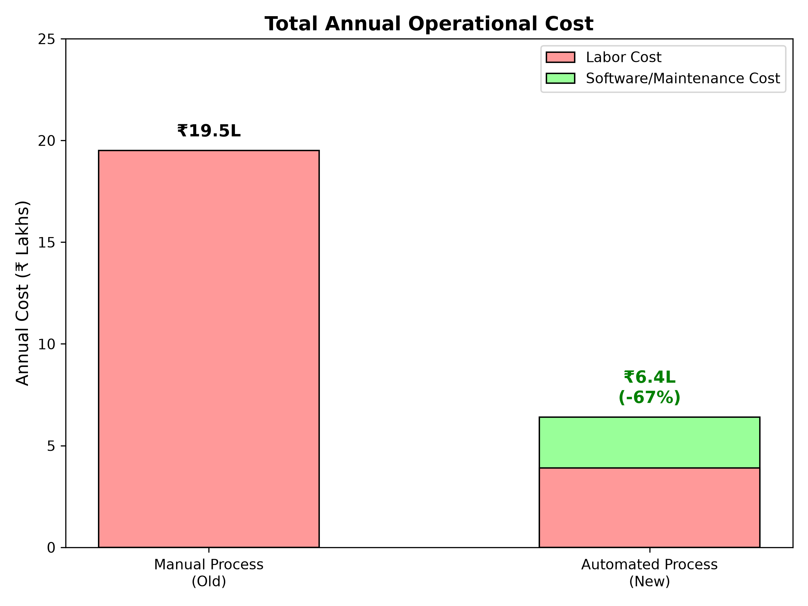
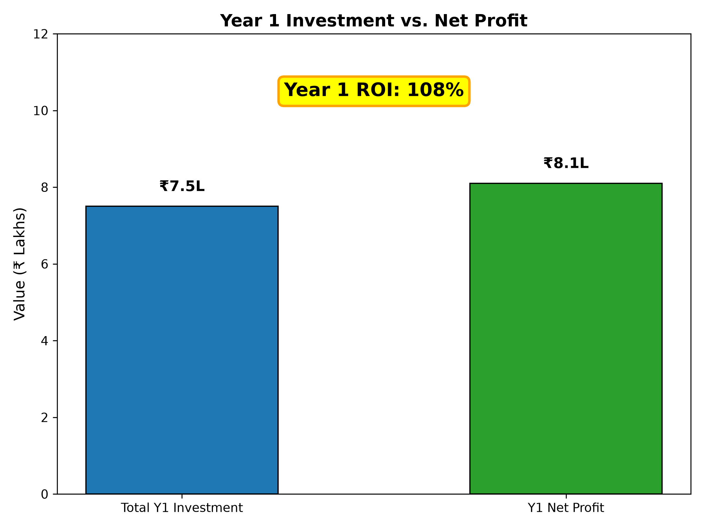
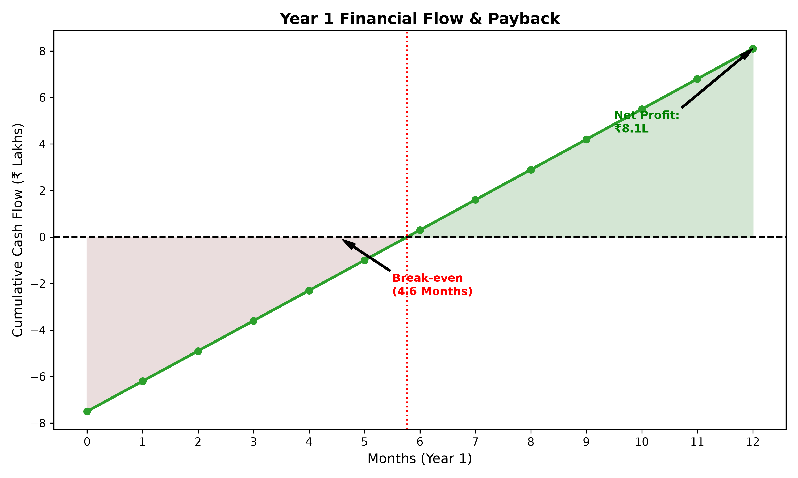
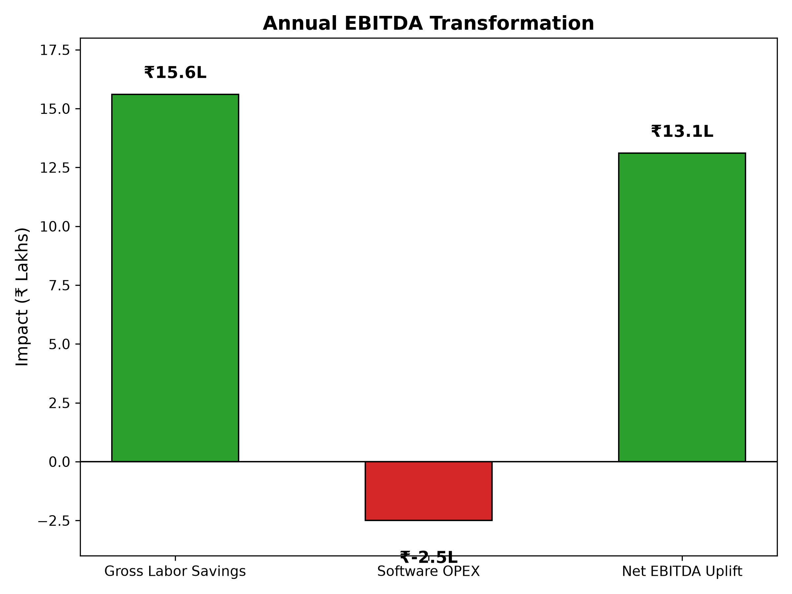

# Business Case Study: Operations Automation

## 1. The Business Pain
Operations teams currently face significant productivity bottlenecks due to inefficient manual workflows. The core challenges include:

| Challenge | Impact on Business |
| :--- | :--- |
| **Scattered Information** | Analysts spend countless hours manually retrieving data from disconnected systems and documents to gather context for a single business question. |
| **Slow Reporting** | Compiling gathered information into standardized reports is a slow, manual process that delays time-to-insight. |
| **High Error Rates** | The lack of automated verification leads to decisions occasionally being made on inaccurate or outdated data, resulting in costly business missteps. |
| **Employee Burnout** | Continuous context switching across different portals reduces team efficiency and overall throughput. |

## 2. The Cost of Inefficiency
Based on industry standards for a mid-sized operations team in India, these manual processes carry a heavy financial burden.

> [!NOTE]
> **Baseline Assumptions**
> * **Team Size:** 5 Operations Analysts
> * **Average Salary:** ₹10.0 Lakhs per annum
> * **Time Spent on Manual Tasks:** 15 hours per week per analyst

**Financial Impact:**
* Total manual hours spent by the team: 3,900 hours per year
* Annual cost of manual labor: **₹19.5 Lakhs**

## 3. How the Solution Saves Costs
The Operations Assistant automates the most time-consuming aspects of research and reporting, acting as a dedicated digital team member.

**Cost Reduction Mechanics:**
* **Automated Workflows:** Reduces the time required to gather data and generate reports from 15 hours to just 3 hours per week per analyst (an 80% reduction).
* **Resource Optimization:** Redirects 12 hours per week per analyst toward high-value, strategic decision-making rather than routine data entry.
* **Error Mitigation:** Built-in automated verification steps prevent costly downstream business mistakes before they happen.

### Projected Savings

| Metric | Manual Process (Old) | Automated Process (New) |
| :--- | :--- | :--- |
| **Time Spent/Week/Analyst** | 15 hours | 3 hours (80% reduction) |
| **Total Hours/Year (Team of 5)** | 3,900 hours | 780 hours |
| **Labor Cost/Year** | ₹19.5 Lakhs | ₹3.9 Lakhs |
| **Software & Maintenance Cost** | ₹0 Lakhs | ₹2.5 Lakhs |
| **Total Annual Cost** | **₹19.5 Lakhs** | **₹6.4 Lakhs** |

> [!TIP]
> **Net Annual Savings = ₹13.1 Lakhs**
> (₹19.5 Lakhs - ₹6.4 Lakhs)

### 4. Advanced Financial Metrics

To provide a realistic and conservative business case, we must factor in the actual costs of building, deploying, and maintaining AI software. Assuming a one-time implementation/setup cost of **₹5.0 Lakhs** (for engineering and training) and an ongoing annual software/maintenance cost of **₹2.5 Lakhs**:

* **Total Initial Investment (Year 1):** ₹7.5 Lakhs (₹5.0L Setup + ₹2.5L Ongoing)
* **First-Year Net Profit:** ₹8.1 Lakhs (Gross Labor Savings of ₹15.6L minus ₹7.5L Investment)
* **Return on Investment (Year 1 ROI):** **108%** (₹8.1 Lakhs / ₹7.5 Lakhs)
* **Payback Period:** **4.6 Months** (Initial ₹5.0L setup divided by ₹1.09L monthly net savings)
* **EBITDA Impact:** By reducing operational expenditures (OPEX) without sacrificing output, the solution generates a direct, ongoing annual EBITDA uplift of **₹13.1 Lakhs**.

By deploying this automation, a standard 5-person operations team can save approximately **₹13.1 Lakhs annually**. A 108% Year-1 ROI and a 4.6-month payback period represent a highly realistic yet exceptional return for enterprise software investments.
